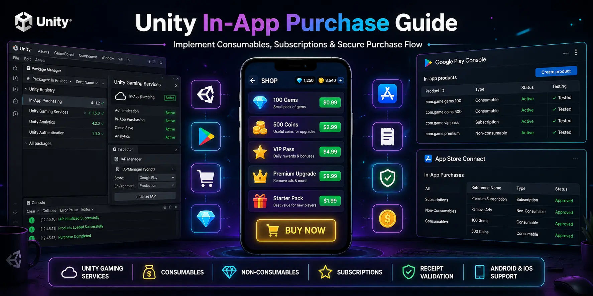

# Unity In-App Purchase Guide

<p align="center">
  
</p>

<p align="center">


</p>

A complete guide to implementing **Unity In-App Purchases (IAP)** for Android and iOS using **Unity Gaming Services**. Learn how to configure consumables, non-consumables, subscriptions, purchase restoration, receipt validation, and production-ready purchasing workflows.

---

# 📚 Table of Contents

- [Overview](#-overview)
- [Features](#-features)
- [Repository Structure](#-repository-structure)
- [Quick Start](#-quick-start)
- [Documentation](#-documentation)
- [Requirements](#-requirements)
- [Roadmap](#-roadmap)
- [Useful Resources](#-useful-resources)
- [Related Repositories](#-related-repositories)
- [About Unity Source Code](#-about-unity-source-code)
- [Contributing](#-contributing)
- [License](#-license)

---

# 📖 Overview

This repository helps Unity developers integrate **Unity In-App Purchases** into mobile games using modern development practices.

Whether you're launching your first premium mobile game or adding monetization to an existing project, this guide covers the complete setup from start to finish.

Topics include:

- Unity Gaming Services
- Unity IAP Installation
- Product Catalog
- Consumable Products
- Non-Consumable Products
- Subscription Products
- Purchase Flow
- Restore Purchases
- Receipt Validation
- Testing Purchases
- Best Practices
- Common Errors
- Troubleshooting

---

# ✨ Features

- Complete Unity IAP Guide
- Android & iOS Support
- Unity Gaming Services Setup
- Product Catalog Configuration
- Consumables
- Non-Consumables
- Subscriptions
- Purchase Restoration
- Receipt Validation
- Production-ready Architecture
- Best Practices
- Beginner Friendly

---

# 📂 Repository Structure

```text
unity-in-app-purchase-guide/

│── README.md
│── LICENSE
│── .gitignore
│
├── docs/
├── code/
├── screenshots/
└── assets/
```

---

# 🚀 Quick Start

Clone the repository.

```bash
git clone https://github.com/unitysourcecode2026/unity-in-app-purchase-guide.git
```

Open the documentation folder and follow each guide step by step.

---

## 📘 Documentation

| Guide | Open |
|-------|------|
| 📖 Introduction | [Introduction](docs/introduction.md) |
| ⚙️ Prerequisites | [Prerequisites](docs/prerequisites.md) |
| 📦 Install Unity IAP | [Install Unity IAP](docs/install-unity-iap.md) |
| ☁️ Unity Gaming Services | [Unity Gaming Services](docs/unity-gaming-services.md) |
| 🛒 Create Products | [Create Products](docs/create-products.md) |
| 💰 Consumable Purchases | [Consumable Purchases](docs/consumables.md) |
| 💎 Non-Consumables | [Non-Consumables](docs/non-consumables.md) |
| ⭐ Subscriptions | [Subscriptions](docs/subscriptions.md) |
| 🔄 Restore Purchases | [Restore Purchases](docs/restore-purchases.md) |
| 🔒 Receipt Validation | [Receipt Validation](docs/receipt-validation.md) |
| 🧪 Testing | [Testing](docs/testing.md) |
| ⭐ Best Practices | [Best Practices](docs/best-practices.md) |
| 🛠️ Common Errors | [Common Errors](docs/common-errors.md) |
| ❓ FAQ | [FAQ](docs/faq.md) |

---

# 💻 Requirements

- Unity 2022 LTS or newer
- Unity Gaming Services
- Unity IAP Package
- Android Build Support
- iOS Build Support
- Google Play Console
- App Store Connect
- C#

---

# 🗺 Roadmap

- [x] Repository Setup
- [ ] Unity Gaming Services
- [ ] Unity IAP Installation
- [ ] Product Configuration
- [ ] Purchase Flow
- [ ] Restore Purchases
- [ ] Receipt Validation
- [ ] Testing
- [ ] Best Practices
- [ ] Troubleshooting
- [ ] FAQ

---

# 🌐 Useful Resources

## Official Documentation

- Unity Documentation
- Unity Gaming Services
- Unity IAP Documentation

## Helpful Tutorials

- 💳 Unity IAP Setup in a Ready-Made Game Template  
  https://unitysourcecode.net/blog/set-up-unity-iap-in-a-ready-made-game-template

- 🎮 Browse Unity Game Templates  
  https://unitysourcecode.net/category/games

---

# 🔗 Related Repositories

Continue learning Unity development.

- 📢 Unity AdMob Integration Guide

https://github.com/unitysourcecode2026/unity-admob-integration-guide

---

# ❤️ About Unity Source Code

Unity Source Code publishes practical Unity development resources including game templates, source code projects, monetization guides, technical documentation, and tutorials to help developers build successful mobile games.

🌍 Website

https://unitysourcecode.net

If this repository helped you:

⭐ Star the repository

🍴 Fork it

📢 Share it with fellow Unity developers

---

# 🤝 Contributing

Contributions, documentation improvements, bug fixes, and suggestions are welcome.

Feel free to open an Issue or submit a Pull Request.

---

# 📄 License

This project is licensed under the MIT License.

---


